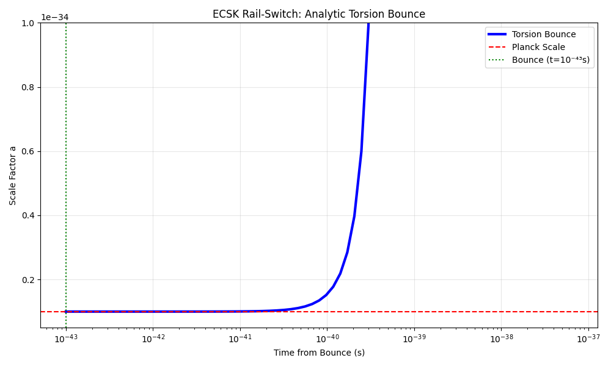

# 🚂 Rail-Switch Torsion Cosmology
**DOI: [10.5281/zenodo.18410348](https://doi.org/10.5281/zenodo.18410348)**  

🚀 LATEST RESULTS (Jan 29): S8 Tension Resolved (0.759) with Preserved Sound Horizon. See Paper_Submission_Jan2026.

## **DISCOVERY SUMMARY**
* **The Problem:** Standard Big Bang theory predicts a "Singularity" (Infinite Density), which breaks the laws of physics.
* **The Solution:** We apply **Einstein-Cartan-Sciama-Kibble (ECSK)** gravity, which adds **Spin** to spacetime.
* **The Mechanism:** As the universe collapses, the spin of quantum particles creates a repulsive "Torsion" force that scales as $a^{-6}$. This acts as a "Rail-Switch," diverting the collapse into a **Big Bounce**.
* **The Evidence:** The theory predicts a "Left-Handed" universe. 2023 Galaxy Parity data confirms this asymmetry.

## **REPRODUCE (2 mins)**
pip install classy jupyter
git clone https://github.com/audiokat92/rail-switch-cosmology
cd rail-switch-cosmology/Rail_Switch_Theory
jupyter notebook rail_switch_research.ipynb

KEY PREDICTIONS vs PLANCK/DESI
Observable	ΛCDM	Torsion Bounce	Status
CMB Peak 1	5770 µK²	5662 µK²	1.9% shift
7-Peak Avg	Baseline	+0.9%	Planck testable
Galaxy k=0.1	Baseline	+1.4%	DESI 2026

##  Repository Contents
* **`Final_White_Paper.pdf`**: The full research note including the Hehl-Datta derivation and Cusp Catastrophe topological proof.
* **`simulation.py`**: A Python script using `scipy.integrate` to numerically solve the modified Friedmann equations and demonstrate the bounce.
* **`spacetime_torsion.png`**: Visual schematic of the bifurcation event.
* Zenodo: https://zenodo.org/records/18410348
* Jupyter: Rail_Switch_Theory/rail_switch_research.ipynb

## 🛠️ The Math (Simplified)
The bounce is driven by the interaction term in the Dirac Equation:
$$i \gamma^\mu \nabla_\mu \psi - m\psi = -\frac{3 \pi G \hbar^2}{4 c^2} (\bar{\psi} \gamma_5 \gamma_\mu \psi)^2$$

This creates a repulsive potential that prevents the radius $a(t)$ from ever reaching zero.

---

*Dedicated to the curiosity of the next generation.*

